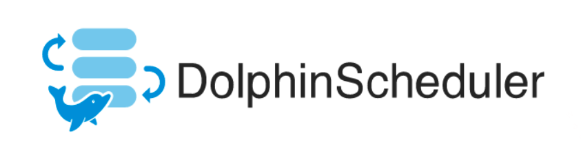
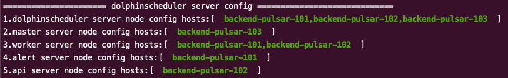

This purpose of this repo is to record some tricks and solutions during the process of
the ds-cluster building.

<center>
   
</center>

<!-- more -->

This purpose of this repo is to record some tricks and solutions during the process of
the ds-cluster building.

<center>
   
</center>
## Catalogue
- [dolphinscheduler-project](#dolphinscheduler-project)
  - [Catalogue](#catalogue)
  - [Main DS Service Composition](#main-ds-service-composition)
  - [Important Glossary](#important-glossary)
  - [Build a Cluster](#build-a-cluster)
    - [Configuration Information](#configuration-information)
      - [1. Test Servers Info](#1-test-servers-info)
      - [2. zookeeper](#2-zookeeper)
      - [3. mysql](#3-mysql)
      - [4. dolphin scheduler project](#4-dolphin-scheduler-project)
      - [5. others](#5-others)


## Main DS Service Composition
DolphinScheduler mainly consists of five services: 
- MasterServer：Mainly responsible for DAG segmentation and task status monitoring
- WorkerServer/LoggerServer：Mainly responsible for the submission, execution and update of task status. LoggerServer is used for Rest Api to view logs through RPC
- ApiServer：Provides the Rest Api service for the UI to call
- AlertServer：Provide alarm service
- UI: Front page display

## Important Glossary
- __Priority__: Support the priority of process instances and task instances, if the priority of process instances and task instances is not set, the default is __first-in-first-out__.
- __Task/Process Priority__: When the number of __worker/process threads__ is insufficient, high-level tasks will be executed first in the execution queue, and tasks/process with the same priority will be executed in the order of first in, first out.
- __Failure Strategy__: notification strategy, process priority, worker group, notification group, recipient, and CC are the same as workflow running parameters.
- __SubProcess__: The sub-process node is to execute a certain external workflow definition as a task node.

## Build a Cluster
### Configuration Information
#### 1. Test Servers Info
- backend-pulsar-101
- backend-pulsar-102
- backend-pulsar-103

#### 2. zookeeper

version：3.7.1
- leader: backend-pulsar-102
- follower: backend-pulsar-101, backend-pulsar-103


#### 3. mysql
version：8.0
Depoy on the docker on the _backend-pulsar-101_ server. 

> Due to ds meta data are stored in the database, it's recommended that the mysql database should be built in the cluster server or the server which owns the __low latency__ to the ds cluster. Otherwise, the io, ui and so on of ds cluster will be badly affected.
<center>
   
</center>

#### 4. dolphin scheduler project

ds version: 2.0.5

<center>
   
</center>

#### 5. others
configuration:
```shell
# The directory to install DolphinScheduler for all machine we config above. It will automatically be created by `install.sh` script if not exists.
# Do not set this configuration same as the current path (pwd)
installPath="/data1_1T/dolphinscheduler"

# Log path
logpath="/data1_1T/dolphinscheduler/logs"

# The directory to store local data for all machine we config above. Make sure user `deployUser` have permissions to read and write this directory.
dataBasedirPath="/tmp/dolphinscheduler"

# resource store on HDFS/S3 path, resource file will store to this hdfs path, self configuration, please make sure the directory exists on hdfs and has read write permissions. "/dolphinscheduler" is recommended
resourceUploadPath="/dolphinscheduler"
```